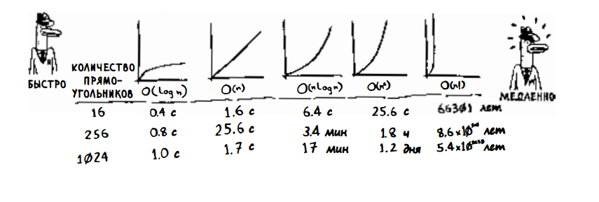

# Algorithms

## Измерение сложности алгоритмов, с помощью "О-большого"

Алгоритмы измеряются по времени выполнения, которое часто обозначается нотацией "О-большое" (O-notation или Big O). Эта нотация описывает, насколько быстро растет время выполнения алгоритма при увеличении размера входных данных.

Среди часто встречающихся вариантов "О-большого":

- **O(log n)** - логарифмическое время, как у бинарного поиска
- **O(n)** - линейное время, как у простого поиска
- **O(n log n)** - время эффективных алгоритмов сортировки
- **O(n^2)** - квадратичное время медленных алгоритмов сортировки
- **O(n!)** - факториальное время очень медленных алгоритмов

"О-большое" измеряет худший случай, гарантируя максимальное время выполнения алгоритма. Оно не учитывает конкретные единицы измерения времени, а показывает, как растет количество операций при увеличении входных данных. Быстрые алгоритмы имеют маленькие показатели O-большого, медленные - большие.
