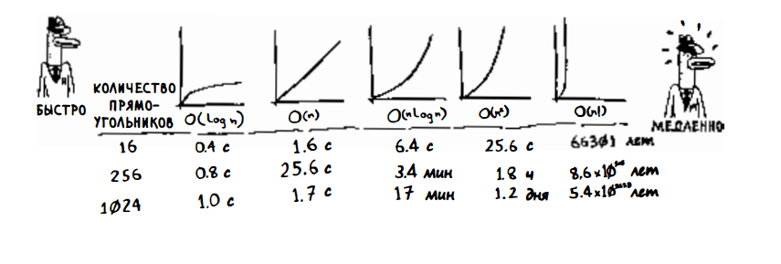
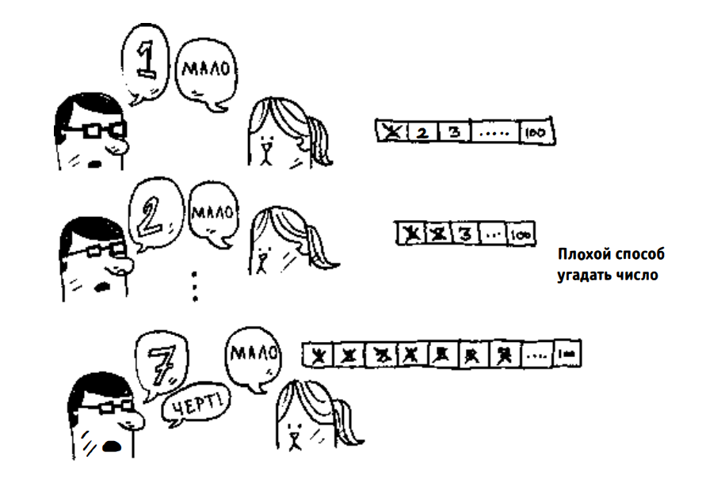
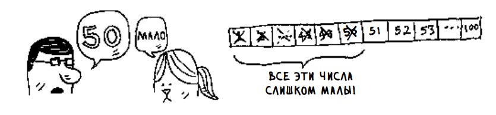
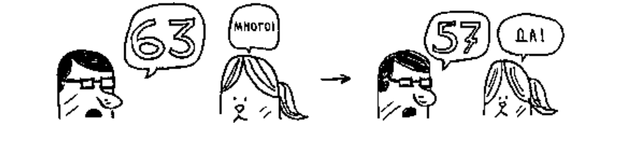

# Algorithms

## Измерение сложности алгоритмов, с помощью "О-большого"

Алгоритмы измеряются по времени выполнения, которое часто обозначается нотацией "О-большое" (O-notation или Big O). Эта нотация описывает, насколько быстро растет время выполнения алгоритма при увеличении размера входных данных.

Среди часто встречающихся вариантов "О-большого":

- **O(log n)** - логарифмическое время, как у бинарного поиска
- **O(n)** - линейное время, как у простого поиска
- **O(n log n)** - время эффективных алгоритмов сортировки
- **O(n^2)** - квадратичное время медленных алгоритмов сортировки
- **O(n!)** - факториальное время очень медленных алгоритмов

"О-большое" измеряет худший случай, гарантируя максимальное время выполнения алгоритма. Оно не учитывает конкретные единицы измерения времени, а показывает, как растет количество операций при увеличении входных данных. Быстрые алгоритмы имеют маленькие показатели O-большого, медленные - большие.

---

# Бинарный поиск

> Бинарный поиск - это алгоритм; на входе он получает отсортированный список элементов. Если элемент, который вы ищете, присутствует в списке, то бинарный поиск возвращает ту позицию, в которой он был найден. В противном случае бинарный поиск возвращает null.

Рассмотрим пример того, как работает бинарный поиск. Сыграем в простую
игру: я загадал число от 1 до 100.

Вы должны отгадать мое число, использовав как можно меньше попыток.
При каждой попытке я буду давать один из трех ответов: «мало» , «много»
или «угадал».

Это пример простого поиска (возможно, термин «тупой поиск» был бы
уместнее). При каждой догадке исключается только одно число. Если я загадал число 99, то, чтобы добраться до него, потребуется 99 попыток!

Существует другой, более эффективный способ. Начнем с 50, т.е с середины.

Слишком мало ... но вы только что исю1ючили половину чисел! Теперь вы
знаете, что все числа 1-50 меньше загаданного. Следующая попытка: 75.

На этот раз перелет ... Но вы снова исключили поJ1овину оставшихся чисел!
С бинарньtм поиском вы каждый раз загадываете число в середине диапазона
и исключаете половину оставшихся чисел. Следующим будет число 63 (по
середине между 50 и 75).

Так работает бинарный поиск. А вы только что узнали свой первый алгоритм! Попробуем поточнее определить, сколько чисеJI будет исключаться каждыи раз. Таким обазом мы имеем логорифимческую сложность O(log n), что намного эффективнее, чем O(n) для простого поиска.
